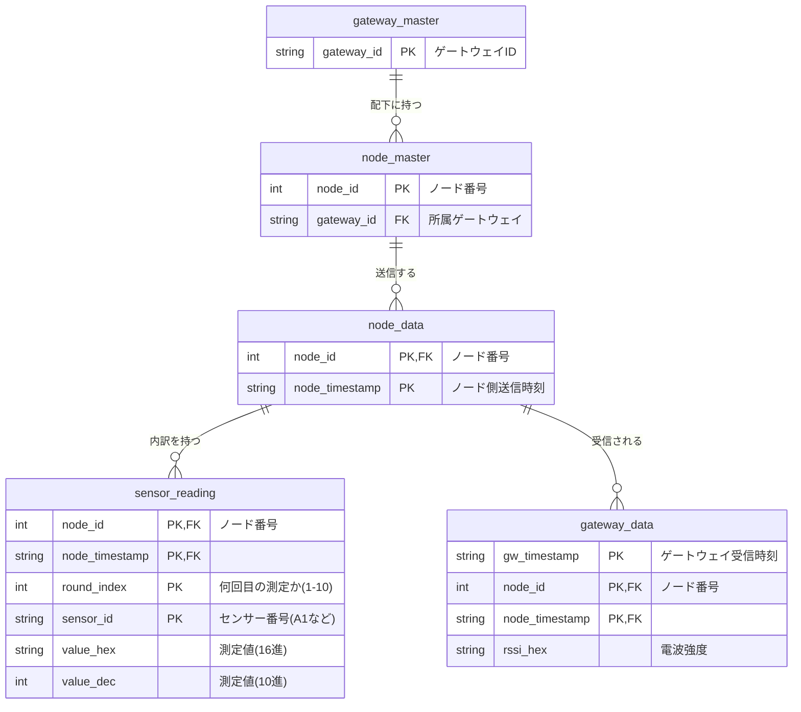

```mermaid
erDiagram
  gateway_master {
    string gateway_id PK "ゲートウェイID"
  }

  node_master {
    int node_id PK "ノード番号"
    string gateway_id FK "所属ゲートウェイ"
  }

  node_data {
    int node_id PK,FK "ノード番号"
    string node_timestamp PK "ノード側送信時刻"
  }

  sensor_reading {
    int node_id PK,FK "ノード番号"
    string node_timestamp PK,FK ""
    int round_index PK "何回目の測定か(1-10)"
    string sensor_id PK "センサー番号(A1など)"
    string value_hex "測定値(16進)"
    int value_dec "測定値(10進)"
  }

  gateway_data {
    string gw_timestamp PK "ゲートウェイ受信時刻"
    int node_id PK,FK "ノード番号"
    string node_timestamp PK,FK ""
    string rssi_hex "電波強度"
  }

  gateway_master ||--o{ node_master : "配下に持つ"
  node_master ||--o{ node_data : "送信する"
  node_data ||--o{ sensor_reading : "内訳を持つ"
  node_data ||--o{ gateway_data : "受信される"
```