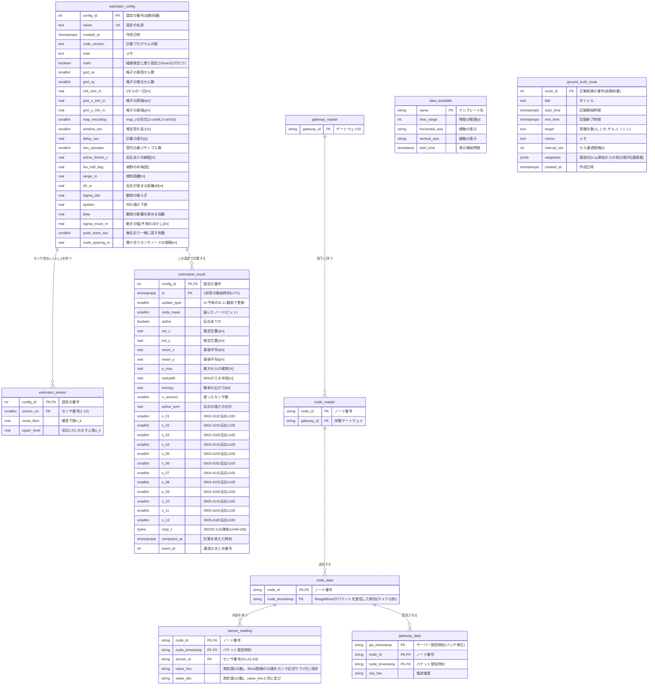

```mermaid
erDiagram
  estimator_config {
    int config_id PK "設定の番号(自動採番)"
    text name UK "設定の名前"
    timestamptz created_at "作成日時"
    text code_version "計算プログラムの版"
    text note "メモ"
    boolean main "経路推定に使う設定か(trueは1行だけ)"
    smallint grid_nx "格子の東西セル数"
    smallint grid_ny "格子の南北セル数"
    real cell_size_m "1セルの一辺[m]"
    real grid_x_min_m "格子の西端x[m]"
    real grid_y_min_m "格子の南端y[m]"
    smallint map_encoding "map_zの形式(1=uint8,2=uint16)"
    smallint window_sec "推定窓の長さ[s]"
    real delay_sec "計算の遅れ[s]"
    smallint min_samples "窓内の最小サンプル数"
    real active_thresh_v "反応ありの振幅[V]"
    real fov_half_deg "視野の半角[度]"
    real range_m "検知距離[m]"
    real d0_m "反応が弱まる距離d0[m]"
    real sigma_obs "観測の揺らぎ"
    real epsilon "外れ値の下限"
    real beta "観測の影響を弱める指数"
    real sigma_move_m "動きの幅(予測のぼかし)[m]"
    smallint quiet_reset_sec "無反応で一様に戻す秒数"
    real node_spacing_m "隣り合うセンサノードの間隔[m]"
  }

  estimator_sensor {
    int config_id PK,FK "設定の番号"
    smallint sensor_no PK "センサ番号(1-12)"
    real noise_floor "雑音下限n_k"
    real upper_level "反応1.0とみなす上限u_k"
  }

  estimation_result {
    int config_id PK,FK "設定の番号"
    timestamptz ts PK "1秒窓の開始時刻(UTC)"
    smallint update_type "0=予測のみ,1=観測で更新"
    smallint node_mask "届いたノード(ビット)"
    boolean active "反応ありか"
    real est_x "推定位置x[m]"
    real est_y "推定位置y[m]"
    real mean_x "事後平均x[m]"
    real mean_y "事後平均y[m]"
    real p_max "最大セルの確率[%]"
    real radius90 "90%が入る半径[m]"
    real entropy "確率の広がり[bit]"
    smallint n_sensors "使ったセンサ数"
    real active_sum "反応の強さの合計"
    smallint s_01 "0002-A1の反応x100"
    smallint s_02 "0002-A2の反応x100"
    smallint s_03 "0002-A3の反応x100"
    smallint s_04 "0003-A1の反応x100"
    smallint s_05 "0003-A2の反応x100"
    smallint s_06 "0003-A3の反応x100"
    smallint s_07 "0004-A1の反応x100"
    smallint s_08 "0004-A2の反応x100"
    smallint s_09 "0004-A3の反応x100"
    smallint s_10 "0005-A1の反応x100"
    smallint s_11 "0005-A2の反応x100"
    smallint s_12 "0005-A3の反応x100"
    bytea map_z "3600セルの確率(uint8+zlib)"
    timestamptz computed_at "計算を終えた時刻"
    int event_id "通過のまとめ番号"
  }

  estimator_config ||--o{ estimator_sensor : "センサ別のn_kとu_kを持つ"
  estimator_config ||--o{ estimation_result : "この設定で計算する"

    gateway_master {
    string gateway_id PK "ゲートウェイID"
  }

  node_master {
    string node_id PK "ノード番号"
    string gateway_id FK "所属ゲートウェイ"
  }

  node_data {
    string node_id PK,FK "ノード番号"
    string node_timestamp PK "BeagleBoneがパケットを受信した時刻(マイクロ秒)"
  }

  sensor_reading {
    string node_id PK,FK "ノード番号"
    string node_timestamp PK,FK "パケット受信時刻"
    string sensor_id PK "センサ番号(A1,A2,A3)"
    string value_hex "測定値(16進)。35ms間隔の10値をカンマ区切りで1行に保存"
    string value_dec "測定値(10進)。value_hexと同じ並び"
  }

  gateway_data {
    string gw_timestamp PK "サーバー受信時刻(バッチ単位)"
    string node_id PK,FK "ノード番号"
    string node_timestamp PK,FK "パケット受信時刻"
    string rssi_hex "電波強度"
  }

  gateway_master ||--o{ node_master : "配下に持つ"
  node_master ||--o{ node_data : "送信する"
  node_data ||--o{ sensor_reading : "内訳を持つ"
  node_data ||--o{ gateway_data : "受信される"


  data_template {
    string name PK "テンプレート名"
    int time_range "時間の範囲[s]"
    string horizontal_axis "横軸の表示"
    string vertical_axis "縦軸の表示"
    timestamp start_time "表示開始時間"
  }

  ground_truth_route {
    int route_id PK "正解経路の番号(自動採番)"
    text title "タイトル"
    timestamptz start_time "記録開始時間"
    timestamptz end_time "記録終了時間"
    text target "実験対象(人,シカ,サル,イノシシ)"
    text memo "メモ"
    int interval_sec "セル通過間隔[s]"
    jsonb waypoints "通過点[ix,iy,開始からの秒]の配列(通過順)"
    timestamptz created_at "作成日時"
  }

```